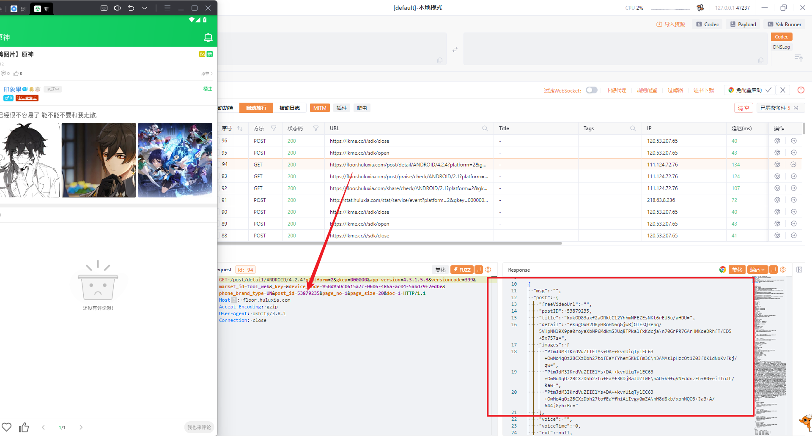
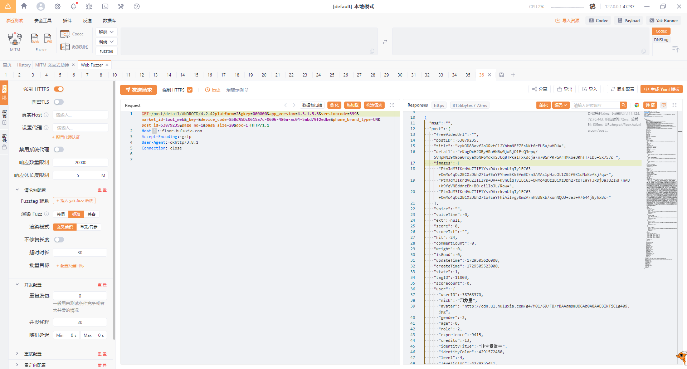
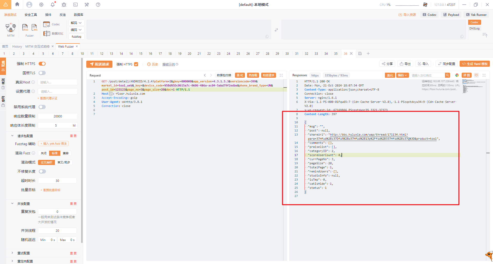
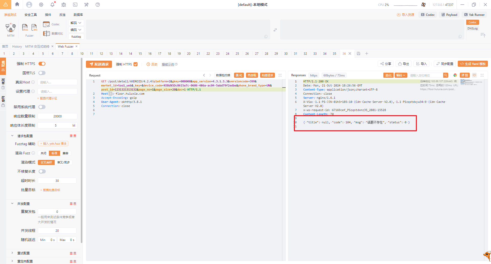
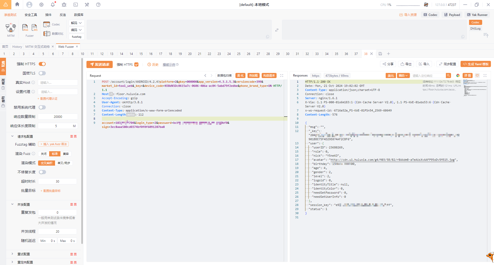
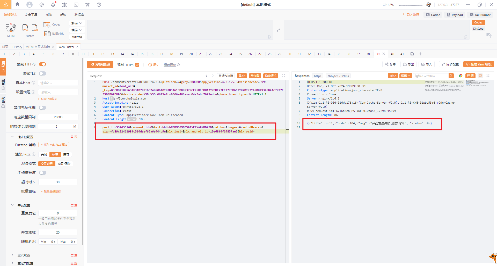
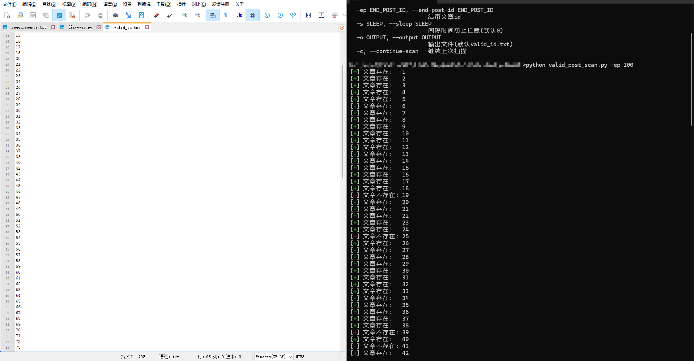

# huluxia_auto_comment

通过python实现葫芦侠自动刷评论

## 分析过程

之前的方法目前已经失效，葫芦侠新增了部分反爬机制，最近收到了部分issue，所以这里来更新一下

### 获取有效帖子的id

首先第一步还是获取有效帖子的id，这里我们抓包来看看



得到获取帖子内容的数据包，可以看到内容是已经加密过了，但此处我们只需要发评论，所以也没必要解密

重发一遍试试有没有防重放



重放没问题，下面我们改一下post_id参数，看看不存在的文章响应是什么样





对比一下发现不存在的文章id返回的内容差异，写个脚本遍历判断即可
这里发包需要把http头也仿照一下，不然会拦截

### 获取登录信息
这里我们最好账号密码登录，直接抓包即可



账号为手机号，密码为md5，返回_key和session_key

### 获取评论数据包
刚刚我们拿到用户凭证了，下面直接抓包评论即可



这里有个问题，现在葫芦侠新增了一个sign参数用来校验数据包，改了数据包校验没过就会提示异常，目前我还没有详细测试过

逆向基础为0的我直接跳过（，以后再随缘分析一下

## 使用方法
vaid_post_scan:

```shell
> python .\valid_post_scan.py                
usage: valid_post_scan.py [-h] [-sp START_POST_ID] [-ep END_POST_ID] [-s SLEEP] [-o OUTPUT] [-c]

HuLuXia Post Scanner

optional arguments:
  -h, --help            show this help message and exit
  -sp START_POST_ID, --start-post-id START_POST_ID
                        起始文章id(默认1)
  -ep END_POST_ID, --end-post-id END_POST_ID
                        结束文章id
  -s SLEEP, --sleep SLEEP
                        间隔时间防止拦截(默认0)
  -o OUTPUT, --output OUTPUT
                        输出文件(默认valid_id.txt)
  -c, --continue-scan   继续上次扫描
```

